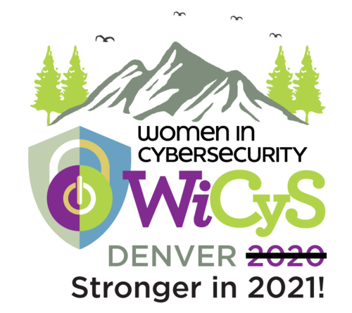

<html>
<meta charset="UTF-8">
<meta name="viewport" content="width=device-width, initial-scale=1">
<link rel="stylesheet" href="style.css">
<body>

  <h1>WiCyS at Illinois</h1>
  

  
1 / 3

  

  
2 / 3

  

  
3 / 3

  

 

   
   
   

<h2>Who We Are</h2>

Women in CyberSecurity (WiCyS) is a student chapter of a larger non-profit national organization dedicated to bringing together women in cybersecurity from academia, research and industry to share knowledge, experience, networking and mentoring. This RSO helps women interested in cyber security through tech talks, workshops, networking opportunities, research, conferences, and leadership opportunities. Our members are given the opportunity to attend the annual WiCyS National Conference and network with companies and fellow students passionate about the field of cyber security. WiCys aims to provide a supportive community to women in all stages of their pursuit of a cybersecurity career.

<h2>Our Mission</h2>
  

To broaden participation in cybersecurity by recruiting, retaining and advancing women in the field of cybersecurity, and improve on the very low 11% statistic of women in cybersecurity jobs. Events we'll be putting on:

  <ul>
  <li>Tech Talks</li>
  <li>Workshops: CTF, Projects, EOH</li>
  <li>Networking opportunities</li>
  <li>Research involvement</li>
</ul>

  <h2>Announcements</h2>
  

  <h3 style="color:red;">Sign up for the 2021 WiCyS National Conference.</h3>
  
If you are interested in applying, please fill out the Google Form below. Deadline to apply is November 1st.

  
</body>
</html>

